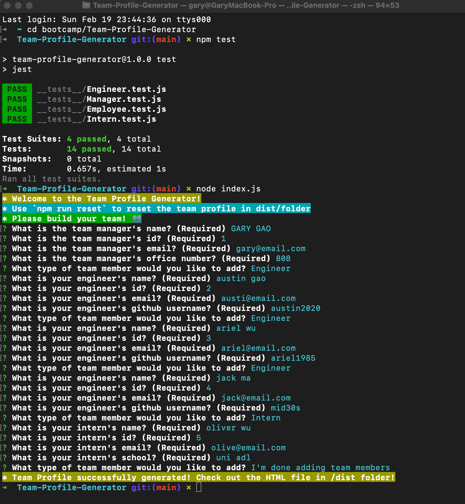
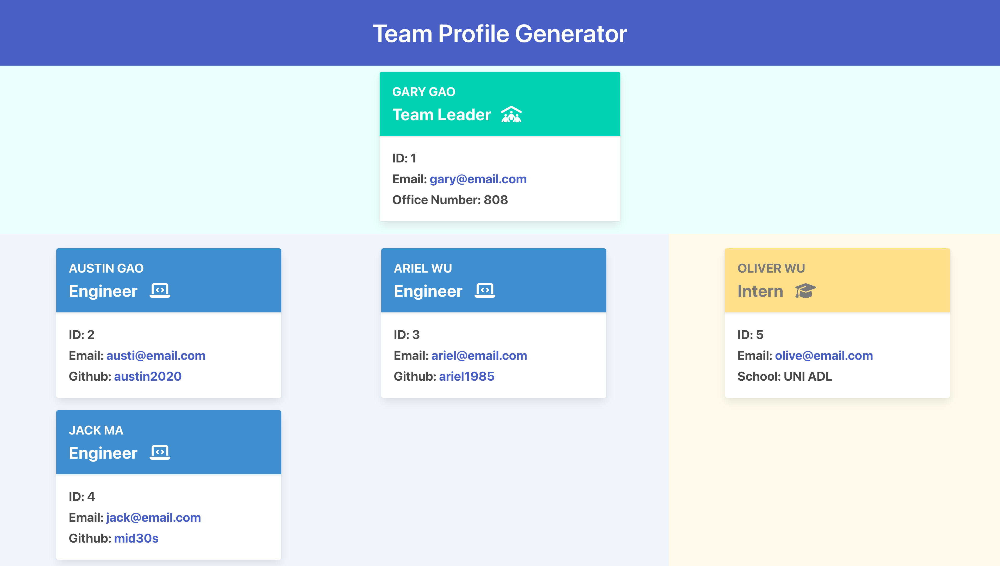

# Team-Profile-Generator

## Description
My team profile generator project is a command-line application that allows users to create a professional-looking team profile page based on the input they provide. The idea for this project came from my desire to create an easy-to-use tool for managers and team leaders to create and manage their team's profile page, which is a crucial aspect of team building and collaboration.

I built this project to solve the problem of manually creating and formatting team profile pages, which can be time-consuming and prone to errors. With this application, users can easily input their team members' information, including their names, roles, IDs, email addresses, and other relevant details, and the program will generate a professional-looking HTML page that can be easily shared with team members or clients.

Through building this project, I learned about various programming concepts, including object-oriented programming, test-driven development, and modularization. I also gained experience working with popular Node.js packages such as Inquirer and Jest, which helped me to streamline the development process and ensure the reliability of the application.

What makes my project stand out is its simplicity and user-friendliness. The application is designed to be intuitive and easy to use, with clear prompts and error messages to guide users through the process. Additionally, the generated HTML page is clean, well-organized, and customizable, allowing users to easily tailor it to their team's needs. Overall, I believe that my team profile generator project is a valuable tool for anyone looking to create a professional-looking team profile page quickly and easily.

## Table of Content
  * [Installation](#installation)
  * [Usage](#usage)
  * [Credits](#credits)
  * [License](#license)
  
## Made With
  
  
  
  
## Installation  
  ```
  npm install inquire@8.2.4

  npm install chalk@2.4.1
  
  npm install jest@24.8.0
  ```

## Usage
 To view this application,the following image shows the landing page of the application, or click on the walkthrough video that demonstrates the functionality of this project: https://drive.google.com/file/d/1RuGKpKmm81o5RDplR0p_1VB4DgbmMQ6p/view
 

  


  
 

## License
  

  Link to license: https://opensource.org/licenses/MIT 

  ```
  Copyright (C) 2023 Gary GAO

  Permission is hereby granted, free of charge, to any person obtaining a copy of this software and associated documentation files (the "Software"), to deal in the Software without restriction, including without limitation the rights to use, copy, modify, merge, publish, distribute, sublicense, and/or sell copies of the Software, and to permit persons to whom the Software is furnished to do so, subject to the following conditions:

  The above copyright notice and this permission notice shall be included in all copies or substantial portions of the Software.

  THE SOFTWARE IS PROVIDED "AS IS", WITHOUT WARRANTY OF ANY KIND, EXPRESS OR IMPLIED, INCLUDING BUT NOT LIMITED TO THE WARRANTIES OF MERCHANTABILITY, FITNESS FOR A PARTICULAR PURPOSE AND NONINFRINGEMENT. IN NO EVENT SHALL THE AUTHORS OR COPYRIGHT HOLDERS BE LIABLE FOR ANY CLAIM, DAMAGES OR OTHER LIABILITY, WHETHER IN AN ACTION OF CONTRACT, TORT OR OTHERWISE, ARISING FROM, OUT OF OR IN CONNECTION WITH THE SOFTWARE OR THE USE OR OTHER DEALINGS IN THE SOFTWARE.
  ```
  
## Contribution
  Thanks for the information about email validation to the prompt questions provided by stackoverflow webpage as follows:\
  https://stackoverflow.com/questions/15017052/understanding-email-validation-using-javascript

## Tests
  ```
  npm run test
  ```
## Questions
  N/A

## Contact
  * For any question about this project, please email me at: gary.yanggao@gmail.com
  * To see more of my projects, follow me on Github at: http://github.com/Mid30s
  
  [](mailto:gary.yanggao@gmail.com)
  [](https://github.com/Mid30s) 

  